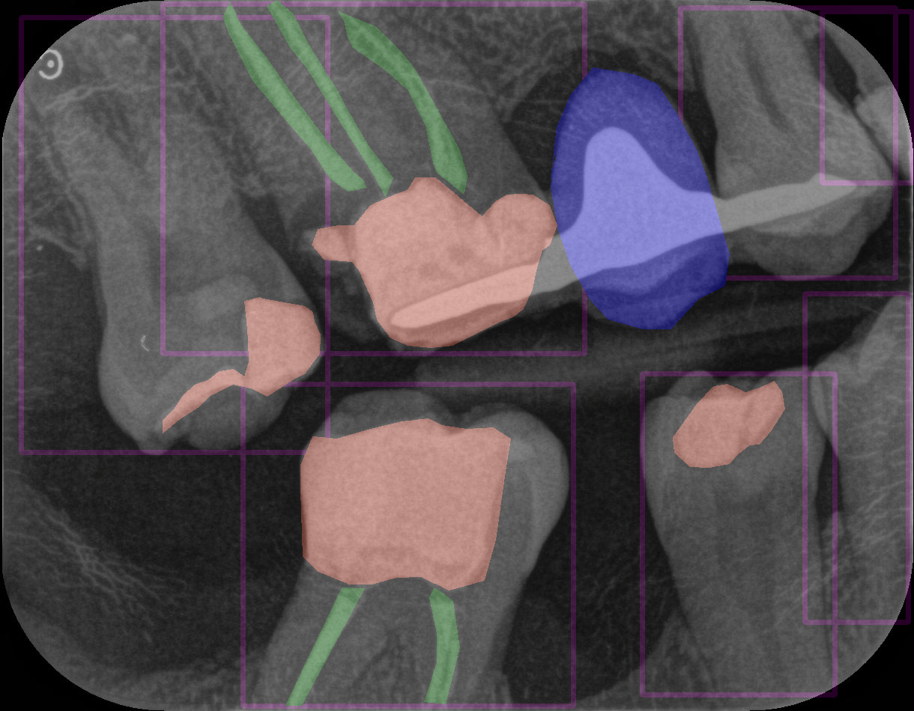
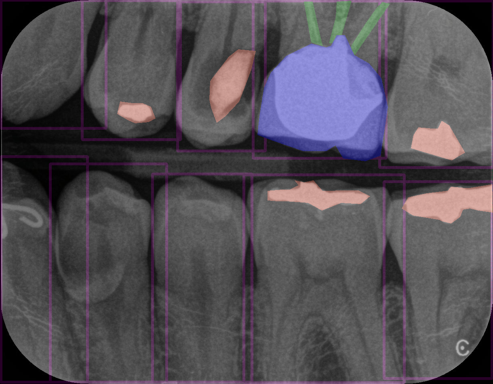
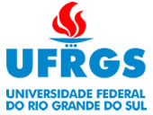

# DeepRAD: Rede neural para segmentação de imagens odontológicas

 	 
	

## Apresentação

O projeto **DeepRAD** do [Grupo de Pesquisa em Inteligência Artificial](https://wp.ufpel.edu.br/gaia/) da [Universidade Federal de Pelotas](https://portal.ufpel.edu.br/) tem como objetivo a identificação dos elementos dentários presentes, anomalias dentárias e no diagnóstico de doenças bucais (lesões periapicais e lesões de cárie), utilizando radiografias panorâmicas e bitewing.

Atualmente está sendo desenvolvido uma Rede Neural Convolucional (CNN) para identificar os seguintes:

- **Restaurações**
- **Coroa dentária**
- **Tratamento de canal**
- **Implante dental**
- **Dente**
- **Polpa dentária**

Importante ressalter que durante o projeto podem vir a serem adicionados novos pontos de interesse que irão ser detectados pelo algoritmo.

No campo odontológico, as CNNs já foram utilizadas para detectar lesões de cárie em radiografias de dentes permanentes, para detecção de perda óssea periodontal em radiografias periapicais ou para diagnosticar tumores na mandíbula em radiografias panorâmicass. **Portanto o uso das CNNs para esses fins pode reduzir esse esforço e facilitar a rotina do cirurgião-dentista.**

Serão analisadas cerca de 100000 radiografias (panorâmicas, periapicais, bitewing) e 8000 tomografias anônimas digitais com seus respectivos laudos digitais radiológicos cedidas por uma clínica radiológica privada. 

Para cada desfecho, o teste de referência será baseado na informação contida nos laudos radiológicos digitais (padrão-ouro) associado às respectivas imagens utilizando processamento de linguagem natural. Será possível utilizar ferramentas de magnificação e aprimoramento das imagens  (contraste e brilho). Será utilizada uma CNN customizada e pré-treinada  e um grid search será desenvolvido.

## Documentação

É possível encontrar a documentação dos códigos do projeto [aqui](./Docs/README.md).

## Dataset

Atualmente, o dataset é composto de radiografias e suas respectivas máscaras (uma para cada classe) geradas a partir das anotações feitas por meio do LabelMe. Ele está dividido em dois sendo que o primeiro só contém as classes dentes e restauração, já o segundo contém todas as classes. O gerador pode ser encontrado no script [convert_annotations.py](./Scripts/convert_annotations.py)

Abaixo é apresentado algumas imagens geradas da combinação das radiografias e suas máscaras para visualização do problema presente:

<figure align="center">
	
	
	
	
	<figcaption>
		Superior esquerdo: <a href="./Masks/Combined-Images-02/imagem-002.png">Imagem combinada 1</a> | 
		Superior direito: <a href="./Masks/Combined-Images-02/imagem-058.png">Imagem combinada 2</a> |
		Inferior esquerdo: <a href="./Masks/Combined-Images-01/imagem-029.png">Imagem combinada 3</a> |
		Inferior direito: <a href="./Masks/Combined-Images-02/imagem-011.png">Imagem combinada 4</a>
	</figcaption>
	<figcaption>Rosa salmão - Restauração | Azul - Coroa | Verde - Tratamento de canal | Amerelo - Implante dental | Retângulos roxos - Dentes</figcaption>
</figure>

- [Imagem combinada 1](./Masks/Combined-Images-02/imagem-002.png):

<figure align="center">
	
	<figcaption>Rosa salmão - Restauração | Azul - Coroa | Verde - Tratamento de canal | Retângulos roxos - Dentes</figcaption>
</figure>

 

- [Imagem combinada 2](./Masks/Combined-Images-02/imagem-058.png):
<figure>
	
	<figcaption>Rosa salmão - Restauração | Azul - Coroa | Verde - Tratamento de canal | Retângulos roxos - Dentes</figcaption>
</figure>

- [Imagem combinada 3](./Masks/Combined-Images-01/imagem-029.png): 

<figure>
	
	<figcaption>Rosa salmão - Restauração | Retângulos roxos - Dentes</figcaption>
</figure>

 

- [Imagem combinada 4](./Masks/Combined-Images-02/imagem-011.png):

<figure align="center">
	
	<figcaption>Rosa salmão - Restauração | Azul - Coroa | Amerelo - Implante dental | Retângulos roxos - Dentes</figcaption>
</figure>

## Modelos disponíveis

Quando estiverem disponíveis colocaremos aqui para que seja possível fazer o download deles.

## Eventos

### Posters Enviados

- **12º IEEE CASS (2022):**

	

## Tecnologias aplicadas

Algumas das tecnologias que foram aplicadas no projeto:

- Python (linguagem de programação utilizada)
- Tensorflow e Keras (biblioteca para treinamento da CNN)
- Segmentation Models (biblioteca que contém algumas arquiteturas populares de CNN implementadas)
- Google Colab (ambiente para treinamento dos modelos)
- LabelMe (anotação dos pontos de interesse nas imagens)

	
	

## Membros

- [Anderson Priebe Ferrugem](https://github.com/MFerrugem)
- [Mauricio Braga de Paula](https://github.com/maubrapa)
- Jonas Almeida Rodrigues
- Dante Augusto Couto Barone
- Guilherme Nunes Peglow
- [Wilians Donizete Da Silva Júnior](https://github.com/wiliansSilva)
- [Felipe Dias Lopes](https://github.com/fdloopes)
- Alessandro Bof de Oliveira
- [Gabriel Leite Bessa](https://github.com/glbessa)

## Instituições parceiras

- **Universidade Federal do Rio Grande do Sul (UFRGS)**
- **Universidade Federal do Pampa (UNIPAMPA)**

	
	

## Metodologia

 

**Materiais e métodos**

Para o desenvolvimento da arquitetura do modelo, será avaliado o desempenho do modelo candidato em relação à área abaixo da curva ROC (AUC). Serão avaliados diferentes números de unidades neurais (16 a 2048 em 2n) e números de filtros (16 a 2048 em 2n) para cada específica camada  convulacional. Posteriormente serão aplicados diferentes tamanhos de núcleo (2x2 a 5x5) e as configurações da camada max-pooling serão avaliadas (2x2 a 4x4). Como funções ativadoras serão usadas unidades lineares retificadas (ReLUs) e sigmoides. O desenvolvimento métrico primário será AUC, que está relacionada com a habilidade de um teste (no caso desse estudo, um modelo) classificar de maneira  correta (saudável/doente). As métricas secundárias serão a sensibilidade e a especificidade, juntamente com os valores preditivos positivo e negativo (VPP e VPN). 

 

**Banco de imagens e pré-processamento**

Serão cedidas cerca de 100000 radiografias (panorâmicas e periapicais, e bitewings) e 8000 tomografias anônimas com seus respectivos laudos radiológicos digitais numerados e também anonimizados cedidos por uma clínica radiológica privada (termos anexados). A partir deste banco bruto, dois examinadores experientes selecionarão as radiografias que não apresentarem alterações de brilho, cor, contraste e posição, dividindo-as de acordo com a técnica (periapical ou bitewing). As imagens serão padronizadas em tamanho (pixels) e cor (RGB).

 

**Desfechos analisados**

Nas panorâmicas e laudos:
- Identificação dos dentes presentes (decíduos e permanentes) em panorâmicas
de pacientes em fase de dentição decídua, mista e permanente;
- Anomalias dentárias (tumores malignos e benignos, dentes supranumerários,
agenesias, dentes impactados, anquilose, fusão, geminação)
- Lesões periapicais em dentes decíduos e permanentes
- Lesões de cárie (proximais).
Nas radiografias bitewings e laudos:
- Lesões de cárie (dentes decíduos e permanentes)Nas radiografias periapicais e laudos:
- Lesões periapicais em dentes decíduos e permanentes
Nas tomografias e laudos:
- Anomalias dentárias (tumores malignos e benignos, dentes supranumerários,
agenesias, dentes impactados, anquilose, fusão, geminação)

 

**Teste de Referência (aprendizado de máquina)**

Para cada desfecho, o teste de referência será baseado na informação
contida nos laudos radiológicos digitais (padrão-ouro) associado às respectivas
imagens utilizando processamento de linguagem natural. Será possível utilizar
ferramentas de magnificação e aprimoramento das imagens (contraste e brilho).

 

**Indicadores, metas e resultados esperados**

Será calculado a reprodutibilidade interexaminador através do teste Kappa de Fleiss (FLEISS JL., 1971), que é uma extensão do pi de Scott (SCOTT, 1955) e avalia a reprodutibilidade de acordo com uma escala nominal entre mais de dois examinadores (FLEISS JL., 1971).

Diferentes modelos de desenvolvimento métrico serão utilizados, tais como AUC, sensibilidade, especificidade, valor preditivo positivo (VPP, também conhecido como precisão) e o valor preditivo negativo (VPN) (SOKOLOVA e LAPALME, 2009).

A AUC está relacionada com a habilidade de evitar uma falsa classificação. A sensibilidade é a capacidade de identificar rótulos positivos enquanto que a especificidade é a capacidade de identificar rótulos negativos. O VPP é responsável pelo acordo de classe dos rótulos de dados com os rótulos positivos fornecidos pelo classificador, já o VPN contabiliza o acordo de classe dos rótulos de dados com os rótulos negativos fornecidos pelo classificador (SOKOLOVA AND LAPALME, 2009).

O desenvolvimento métrico primário será AUC, que está relacionada com a habilidade de um teste (no caso desse estudo, um modelo) classificar de maneira correta (saudável/doente).

As métricas secundárias serão a sensibilidade e a especificidade, juntamente com os valores preditivos positivo e negativo (VPP e VPN) (EKERT, T. et.al., 2019).

## Referências

Abesi F, Mirshekar A, Moudi F, Seyedmajidi M, Haghanifar S, Haghighat N, Bijani A. Diagnostic accuracy of digital and conventional radiography in the detection of non-cavitated approximal dental caries. Iran J Radiol. 2012; 9(1):17-21.

Aerts HJWL, Grossmann P, Tan Y, et al. Defining a radiomic response phenotype: a pilot study using targeted therapy in NSCLC. Sci Rep. 2016;6:33860.

Keek SA, Leijenaar RT, Jochems A, et al. A review on radiomics and the future of theranostics for patient selection in precision medi- cine. Br J Radiol. 2018;91:20170926.

Aerts HJWL. The potential of radiomic-based phenotyping in precision medicine: a review. JAMA Oncol. 2016;2:1636–42.

Becker AS, Marcon M, Ghafoor S, Wurnig MC, Frauenfelder T, Boss A. Deep Learning in Mammography: Diagnostic Accuracy of a Multipurpose Image Analysis Software in the Detection of Breast Cancer. Investig Radiol 2017;52(7):434-440.

Buda M, Maki A, Mazurowski M. A systematic study of the class imbalance problem in convolutional neural network. arXiv 2017: arXiv:1710.05381.

Chen H, Zhang K, Lyu P, Li H, Zhang L, Wu J, Lee CH. A deep learning approach to automatic teeth detection and numbering based on object detection in dental periapical films. Scientific Reports 2019 9:3840. doi.org/10.1038/s41598-019-40414-y.

Chung JS, Senior AW, Viyals O, Zisseman A. Lip reading sentences in the wild. In: CVPR 2017; 3444-3453.

Constanzo J, Wei L, Tseng HH, et al. Radiomics in precision medi- cine for lung cancer. 

Transl Lung Cancer Res. 2017;6:635–47.

Ekert T, Krois J, Meinhold L, Elhennawy K, Emara R, Golla T, Schwendicke F. Deep learning for the radiographic detection of apical lesions. Journal of Endodontics 2019.

Esteva A, Kuprel B, Novoa RA, Ko J, Swetter SM, Blau HM, et al. Dermatologist-level classification of skin cancer with deep neural networks. Nature 2017;542(7639):115-118.

Giardino A, Gupta S, Olson E, et al. Role of imaging in the era of precision medicine. Acad Radiol. 2017;24:639–49.

Gulshan V, Peng L, Coram M, Stumpe MC, Wu D, Narayanaswamy A, et al. Development and Validation of a Deep Learning Algorithm for Detection of Diabetic Retinopathy in Retinal Fundus Photographs. JAMA 2016;316(22):2402-2410.

Gwet KL. 2008. Computing inter-rater reliability and its variance in the presence of high agreement. Br J Math Stat Psychol. 61(1):29–48.

Hussain Z, Gimenez F, Yi D, Rubin D. Differential data augmentation techniques for medical imaging classification tasks. In: AMIA Annual Symposium Proceedings. 2017; p979.

Ioffe S, Szegedy C. Batch Normalization: Accelerating Deep Network Training by Reducing Internal Covariate Shift. arXiv 2015:arXiv:150203167.

LeCun Y, Bengio Y, Hinton G. Deep learning. Nature 2015;521(7553):436-444.

Lee JH, Kim DH, Jeong SN, Choi SH. Detection and diagnosis of dental caries using a deep learning-based convolutional neural network algorithm. Journal of dentistry 2018a;77:106-111.

Lee JH, Kim DH, Jeong SN, Choi SH. Diagnosis and prediction of periodontally compromised teeth using a deep learning-based convolutional neural network algorithm. J Periodont Impl Sci 2018b;48(2):114-123.

Litjens G, Kooi T, Bejnordi BE, Setio AAA, Ciompi F, Ghafoorian M, et al. A survey on deep learning in medical image analysis. Med Image Analysis 2017;42:60-88.

Mazurowski MA, Buda M, Saha A, Bashir MR. Deep learning in radiology: an overview of the concepts and a survey of the state of the art with focus on MRI. J Magn Reson Imaging 2019; 49(4):939-954.

Poedjiastoeti W, Suebnukarn S. Application of Convolutional Neural Network in the Diagnosis of Jaw Tumors. Healthc Inform Res. 2018;24(3):236-241.

Schwendicke F, Tzschoppe M, Paris S. Radiographic caries detection: a systematic review and meta-analysis. Journal of Dentistry 2015; doi http://dx.doi.org/10.1016/j.dent.2015.02.009

Schwendicke F, Golla T, Dreher M, Krois J. Convolutional neural networks for dental image diagnostics: A scoping review. 2019; doi https://doi.org/10.1016/j.jdent.2019.103226

Schwendicke F, Elhennawy K, Paris S, Friebertsha ̈user P, Krois J, Deep Learning for Caries Lesion Detection in Near-Infrared Light Transillumination Images: A Pilot Study, Journal of Dentistry. 2020; doi:https://doi.org/10.1016/j.jdent.2019.103260

Scott WA. Reliability of Content Analysis: The Case of Nominal Scale Coding.Public Opin Q. 1955; 19(3):321.

Sokolova M, Lapalme G. A systematic analysis of performance measures for classification tasks. Inf Process Manag. 2009; 45(4):427–437.

Taygman Y, Yang M, Ranzato M, Wolf L. DeepFace: Closing the Gap to Human Level Performance in Face Verification. In: Proc IEEE Conf Comput Vis Pattern Recognit 2014; 1701-1708.

Wu R, Yan S, Shan Y, Dang Q, Sun G. Deep image: sacling uo image recognition. arXiv Prep 2015; arXiv150102876.