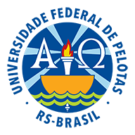
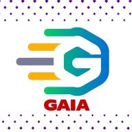

# DeepRAD: Rede neural para segmentação de imagens para odontologia

 	 
	

<!--
-->

## Apresentação

O projeto **DeepRAD** do [Grupo de Pesquisa em Inteligência Artificial](https://wp.ufpel.edu.br/gaia/) da [Universidade Federal de Pelotas](https://portal.ufpel.edu.br/) tem como objetivo facilitar a detecção de pontos de interesse em radiografias dentárias.

Atualmente esses pontos são:

- **Restaurações**
- **Coroa dentária**
- **Tratamento de canal**
- **Implante dental**
- **Dente**
- **Polpa dentária**

Importante ressalter que durante o projeto podem vir a serem adicionados novos pontos de interesse que irão ser detectados pelo algoritmo.

---

## Exemplos

A seguir são apresentados alguns exemplos dos resultados já obtidos:

---

## Modelos disponíveis

Quando estiverem disponíveis colocaremos aqui para que seja possível fazer o download deles.

---

## Eventos

Posters Enviados:

- **12º IEEE CASS (2022):**

<!---->

---

## Tecnologias aplicadas

Algumas das tecnologias que foram aplicadas no projeto:

- Python (linguagem de programação utilizada)
- Tensorflow e Keras (biblioteca para treinamento da rede neural)
- Segmentation Models (biblioteca que contém alguns modelos populares de CNN implementados)
- Google Colab (ambiente para treinamento dos modelos)
- LabelMe (anotação dos pontos de interesse nas imagens)

	
	

     
 

<!--## Metodologia

## Cronograma do projeto-->

---

## Membros

- [Anderson Priebe Ferrugem](https://github.com/MFerrugem)
- [Mauricio Braga de Paula](https://github.com/maubrapa)
- Jonas Almeida Rodrigues
- Dante Augusto Couto Barone
- Guilherme Nunes Peglow
- [Wilians Donizete Da Silva Júnior](https://github.com/wiliansSilva)
- [Felipe Dias Lopes](https://github.com/fdloopes)
- Alessandro Bof de Oliveira
- [Gabriel Leite Bessa](https://github.com/glbessa)